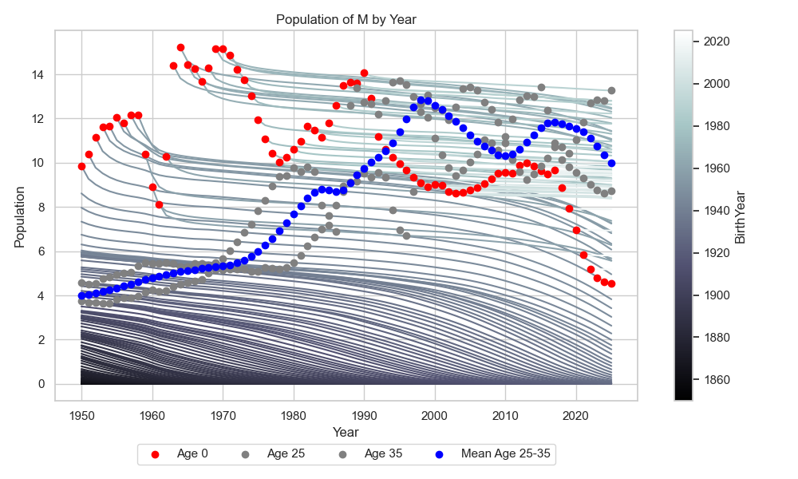
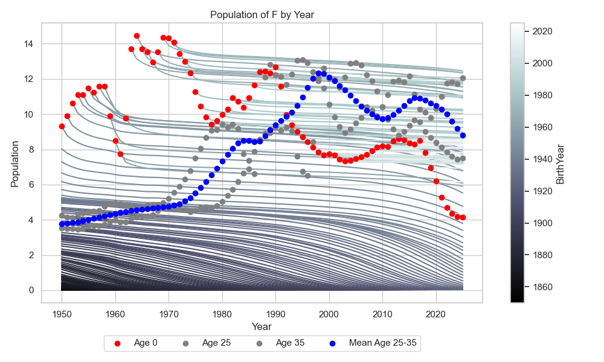
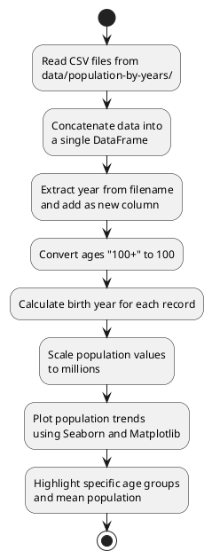

# Population by Years Analysis

国家统计局报道说2024年中国新生儿数量达到950万，手上又恰好有合适的历史数据，特写本文，希望能说明白历年新生儿数量变化的规律。

[toc]

## Visualizations

- Population of Males by Year

- Population of Females by Year

上图是比较完整的中国人口结构图，包含很多信息。其中的曲线代表不同年份出生的人口数量年度变化，曲线的颜色代表人口出生的年份。红点代表当年出生人口的数量，因此曲线总是以红色点开始，逐渐降低到零结束。图中不从红点开始的曲线代表1950年之前出生的人口，由于数据中查不到这些年份的信息因此省略。

图中灰色的点代表年龄为25和35岁的人口数量，蓝色点代表年龄在25-35岁这个范围内的人口数量平均值。在分析这些曲线时需要考虑横坐标，横坐标代表数据年份。以蓝色线的峰值为例，峰值出现在1998年处，这个年龄段内，男性（M）和女性（F）人口的按年龄平均数量在12-13百万之间。而当年出生的人口数量在8-9百万之间。

### 峰值与谷点1998

注意到1998年时，25-35岁的人口数量处于局部和全局峰值，但当年的出生人口接近局部谷点，这代表当时适龄生育人口的生育意愿并不强烈。
事实上下降并没有止于1998，而是继续下降直到2002年才出现反弹。

### 千禧宝宝

值得一提的是2000年所谓的“千禧宝宝”，这是个世纪之交的称谓上的好彩头。从生育数据上来看，它确实在新生儿数量下降的过程中出现了一个小的峰值。说明这样的彩头还是有助于提升当年生育意愿的。
有趣的是，2025年这批“千禧宝宝”恰好25岁，不知道他们为950万“龙宝宝”做了多少贡献。

### 1998之后

2002年9月施行的《中华人民共和国人口与计划生育法》明确规定，国家稳定现行生育政策，鼓励公民晚婚晚育，提倡一对夫妻生育一个子女;符合法律、法规规定条件的，可以要求安排生育第二个子女。
2013年11月，启动实施一方是独生子女的夫妇可生育两个孩子的政策，逐步调整完善生育政策，促进人口长期均衡发展。
2015年10月29日，全面实施一对夫妇可生育两个孩子政策，积极开展应对人口老龄化行动。
这导致了在此期间新生儿数量缓慢回升。之后就是持续下降。

我们以2015年为界，对之前的上升和之后的下降进行分别分析：

- 在2002-2015年这段时间里，适龄生育人口继续下降，但新生儿却增多了。这代表计划生育政策放开确实起到了“逆周期调节”的作用，生育意愿确有上升。
- 尤其是在2010年这个时间点，适龄生育人口与新生儿数量开始同步上升，如果生育意愿继续升高，甚至能保持不变的话，新生数量就不会跳水。
- 然而，时间到了2015年之后，适龄生育人口与新生儿数量同步下降，甚至新生儿数量下降远快于适龄生育人口数量的下降，下降的趋势直到2025年的现在才有所收敛。

### 交叉点1992

从这个点开始向左看，时间来到1992年，在这之前红色点高于蓝色点，在这之后二者交换。这说明以1992年为界，在这之前平均一名适龄人口恰好创造一名新生儿，在这之后生育比例降低。难怪有人口学者以此为界进行研究。
[1992年进入低生育水平](http://m.chinareform.net/plus/view.php?aid=32040 "1992年进入低生育水平")

### 第二次生育潮1978-1990

再向左看，可以立即看到1978-1990年的婴儿潮，这是从1978年开始到1990年达到巅峰的长达20年的生育上升期。这个时期有一个明显特点那就是适龄生育人口与新生儿数量同步上升。这代表人们的生育意愿并没有提升，但由于基数大，导致新生儿增多。

### 第二次生育下降1970-1978

再向左看，这个阶段虽然适龄生育人口数量增加，但新生儿数量逐年下降，这代表他们的生育意愿却逐年下降。

### 第一次生育潮与三年自然灾害1950-1970

再向左看，由于建国带来的重大利好，在适龄生育人口数量变化不大的单提下，新生儿数量却连年增加。这说明生育意愿不断增强。尤其值得注意的是1952年的朝鲜战争并没有引起生育下降。而这个趋势在1959-1961年发生了明显下降，这个时间是三年自然灾害，属于不可抗力。这个时期不仅生育数量明显下降，新生儿死亡率也在提高，这说明了那个时候的艰难。灾害结束后增加的趋势立即恢复，一直持续到1970年。

值得注意的是马寅初的《新人口论》于1957年7月5日首次在《人民日报》上全文发表，但显然这个理论并没有阻碍生育高峰的前进。

---

以下是数据获取与分析绘图的细节。

## Script Flow Diagram

This script reads population data from multiple CSV files, concatenates them into a single DataFrame, and visualizes the population trends over the years for different age groups and genders.

## Data Source

The data is sourced from [Population Pyramid](https://population-pyramid.net/zh-cn/pp/%E4%B8%AD%E5%9B%BD) and is stored in CSV files named in the format `中国_[year].csv`.

## Script Explanation

The script reads all CSV files from the `data/population-by-years/` directory and concatenates them into a single DataFrame. Each file contains population data for a specific year. The year is extracted from the filename and added as a new column in the DataFrame.

The script processes the data by converting ages "100+" to 100 and calculating the birth year for each record. It also scales the population values for better visualization by converting the population numbers to millions.

The script uses Seaborn and Matplotlib to visualize the population trends. It plots the population of males and females over the years, grouped by birth year. Additionally, it highlights specific age groups (0, 25, and 35) and the mean population in the age range 25 to 35.

The legend is placed at the bottom of the plot in a single row, and the colorbar is made smaller for better readability.

## Conclusion

This script provides a comprehensive analysis of population trends over the years, highlighting key age groups and visualizing the data in an easy-to-understand format.

